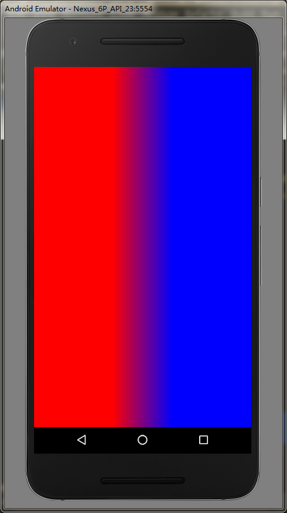
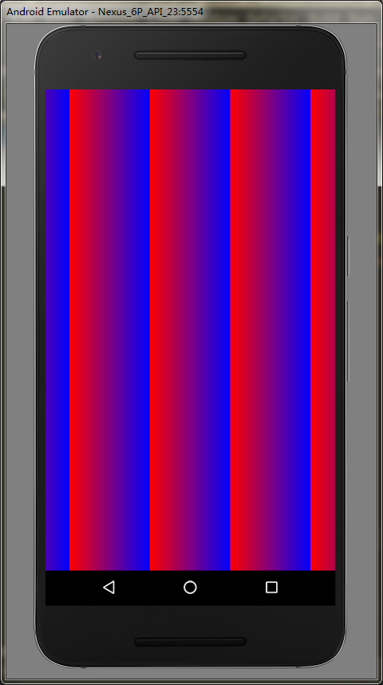
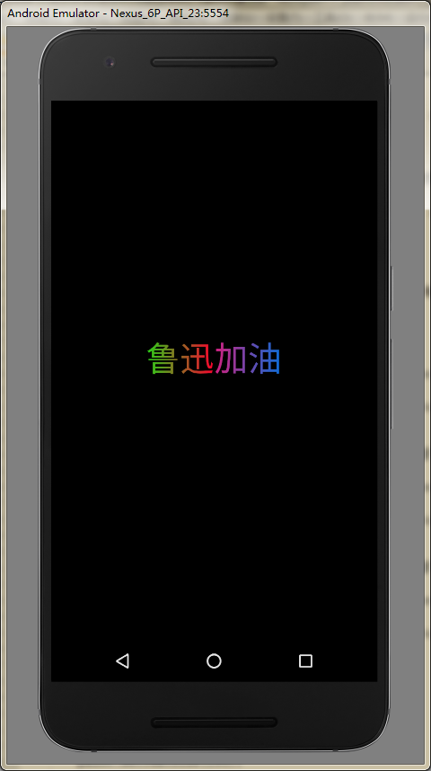

# Paint详解  
## Paint API分类  
* 颜色  
* 效果  
* drawText()相关  
* 初始化  
## Paint颜色API  
### 基本颜色  
我们在使用canvas的时候，可以使用其drawColor等相关方法来直接填充颜色，而drawBitmap中的颜色是Bitmap对象提供的，其余的绘制，需要设置颜色时，就需要使用到Paint了  
### Paint设置基本颜色  
#### 直接设置颜色  
* setColor(int color);  
* setARGB(int a, int r, int g, int b);  
#### 设置Shader  
> Shader:着色器，是一个颜色方案，设置了Shader时，Paint不再使用setColor/setARGB直接设置的颜色  
  
##### Android中Shader的子类  
> Android中不直接使用Shader，而是使用其的几个子类  
  
###### LinearGradient:线性渐变  
构造方法：  
*两种颜色：*  
> LinearGradient(float x0, float y0, float x1, float y1, int color0, int color1, TileMode tile)  
  
参数说明：  
* (x0, y0),(x1, y1):两个端点的坐标  
* color0, color1:两个端点的颜色，color0对应端点(x0,y0)的颜色，color1对应端点(x1,y1)的颜色  
  
*多种颜色：*  
> LinearGradient(float x0, float y0, float x1, float y1, int colors[], float positions[], TileMode tile)  
  
参数说明：  
* (x0, y0),(x1, y1):两个端点的坐标  
* int colors[]:颜色数组  
* float positions[]:颜色数组中各个颜色对应的位置，这里的每个值的取值范围是[0-1]，这里就理解成该位置与起始端点的距离占开始端点与结束端点距离（就是上面两个端点直接的距离）的比例就可以了  

*TileMode:着色规则*  
* Shader.TileMode.CLAMP:颜色从端点向周围发散  
```  
LinearGradient linearGradient = new LinearGradient(-200, 0, 200, 0, Color.RED, Color.BLUE, Shader.TileMode.CLAMP);
        paint.setShader(linearGradient);
        canvas.drawRect(-width/2, -height/2, width/2, height/2, paint);  
```  
  
* Shader.TileMode.MIRROR:颜色从两端点向中间发散，然后沿着两端点连线方向镜像颜色  
```  
LinearGradient linearGradient = new LinearGradient(-200, 0, 200, 0, Color.RED, Color.BLUE, Shader.TileMode.MIRROR);
        paint.setShader(linearGradient);
        canvas.drawRect(-width/2, -height/2, width/2, height/2, paint);  
```  
  
* Shader.TileMode.REPEAT:颜色从两端点向中间发散，然后沿着两端点连线方向重复颜色  
```  
LinearGradient linearGradient = new LinearGradient(-200, 0, 200, 0, Color.RED, Color.BLUE, Shader.TileMode.REPEAT);
        paint.setShader(linearGradient);
        canvas.drawRect(-width/2, -height/2, width/2, height/2, paint);  
```  
  
*多颜色实例*  
```  
canvas.drawColor(Color.BLACK);
        canvas.translate(width*1.0f/2, height*1.0f/2);
        String text = "鲁迅加油";
        paint.setTextSize(150);
        float offset = paint.measureText(text)/2;
        int[] color = {Color.parseColor("#2ad018"), Color.parseColor("#fe002e"), Color.parseColor("#d5207f"), Color.parseColor("#0b6dd8")};
        float[] position = {0f, 0.5f, 0.5f, 1f};
        LinearGradient linearGradient = new LinearGradient(-offset, 0, offset, 0, color, position, Shader.TileMode.CLAMP);
        paint.setShader(linearGradient);
        canvas.drawText(text, -offset, 0, paint);  
```  
  
