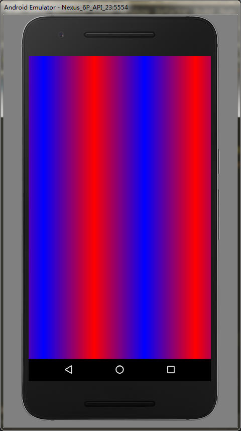

# Paint详解  
## Paint API分类  
* 颜色  
* 效果  
* drawText()相关  
* 初始化  
## Paint颜色API  
### 基本颜色  
我们在使用canvas的时候，可以使用其drawColor等相关方法来直接填充颜色，而drawBitmap中的颜色是Bitmap对象提供的，其余的绘制，需要设置颜色时，就需要使用到Paint了  
### Paint设置基本颜色  
#### 直接设置颜色  
* setColor(int color);  
* setARGB(int a, int r, int g, int b);  
***  
#### 设置Shader  
> Shader:着色器，是一个颜色方案，设置了Shader时，Paint不再使用setColor/setARGB直接设置的颜色  
  
##### Android中Shader的子类  
> Android中不直接使用Shader，而是使用其的几个子类  
  
---  
###### LinearGradient:线性渐变  
*两种颜色：*  
> LinearGradient(float x0, float y0, float x1, float y1, int color0, int color1, TileMode tile)  
  
参数说明：  
* (x0, y0),(x1, y1):两个端点的坐标  
* color0, color1:两个端点的颜色，color0对应端点(x0,y0)的颜色，color1对应端点(x1,y1)的颜色  
  
*多种颜色：*  
> LinearGradient(float x0, float y0, float x1, float y1, int colors[], float positions[], TileMode tile)  
  
参数说明：  
* (x0, y0),(x1, y1):两个端点的坐标  
* int colors[]:颜色数组  
* float positions[]:颜色数组中各个颜色对应的位置，这里的每个值的取值范围是[0-1]，这里就理解成该位置与起始端点的距离占开始端点与结束端点距离（就是上面两个端点直接的距离）的比例就可以了  
---  
###### RadialGradient:辐射渐变  
*两种颜色：*  
> RadialGradient(float centerX, float centerY, float radius, int centerColor, int edgeColor, TileMode tileMode)  
  
参数说明：  
* (centerX, centerY), radius:原点以及辐射半径  
* centerColor, edgeColor:中心点颜色和边缘颜色(这个构造方法中，中心点颜色向边缘扩散，边缘颜色向中心扩散，所有表现出来两种颜色的混合渐变范围各占半径的一半)  
  
*多种颜色：*  
> RadialGradient(float centerX, float centerY, float radius, int colors[], float stops[], TileMode tileMode)  
  
参数说明：
* (centerX, centerY), radius:原点以及辐射半径  
* colors:颜色数组  
* stops:这里的官方因为解释确实没看懂，只知道取值范围是0-1，我实际测试了一下，实际的表现是该位置上的颜色（即：colors[index]）开始向中心和边缘混合渐变的离圆心的距离（即：radius*stops[index]）  
> 特别说明：stops[0]的值不是0的话，第一个颜色的开始渐变位置到圆心的范围内都着色为第一个颜色，不会渐变（这也好理解，第一个颜色之前没有颜色，自然它向中心扩散时就没有别的颜色来混合，自然也就没有渐变咯）  
---  
###### SweepGradient:扫描渐变  
*两种颜色：*  
> SweepGradient(float cx, float cy, int color0, int color1)  
  
参数说明：  
* (cx, cy):圆心坐标  
* color0, color1:color0表示沿时针方向0度的颜色，color1表示沿时针方向360度的颜色（所以这个着色规则是颜色从角度向更小角度和更大角度扩散混合）  
  
*多种颜色：*  
> SweepGradient(float cx, float cy, int colors[], float positions[])  
  
参数说明：  
* (cx, cy):圆心坐标  
* colors:颜色数组  
* positions:取值范围：0-1，表示相应的颜色更小角度和更大角度开始扩散混合的角度（即：360*positions[index]）  
---  
###### BitmapShader:图片着色  
> BitmapShader(Bitmap bitmap, TileMode tileX, TileMode tileY)  
> 说明：这里的图片是从当前坐标原点开始绘制（就是图片的左上角在当前坐标原点），其余两个参数为图片在横纵坐标上的，图片大小范围外的着色规则  
---  
###### ComposeShader:混合作色器  
> ComposeShader(Shader shaderA, Shader shaderB, Xfermode mode)  
> ComposeShader(Shader shaderA, Shader shaderB, PorterDuff.Mode mode)  
  
---  
*TileMode:着色规则*  
> 是定义的范围外的颜色着色规则  
* Shader.TileMode.CLAMP:颜色从端点向周围发散  
```  
	LinearGradient linearGradient = new LinearGradient(-200, 0, 200, 0, Color.RED, Color.BLUE, Shader.TileMode.CLAMP);
        paint.setShader(linearGradient);
        canvas.drawRect(-width/2, -height/2, width/2, height/2, paint);  
```  
  
* Shader.TileMode.MIRROR:颜色从两端点向中间发散，然后沿着两端点连线方向镜像颜色  
```  
	LinearGradient linearGradient = new LinearGradient(-200, 0, 200, 0, Color.RED, Color.BLUE, Shader.TileMode.MIRROR);
        paint.setShader(linearGradient);
        canvas.drawRect(-width/2, -height/2, width/2, height/2, paint);  
```  
  
* Shader.TileMode.REPEAT:颜色从两端点向中间发散，然后沿着两端点连线方向重复颜色  
```  
	LinearGradient linearGradient = new LinearGradient(-200, 0, 200, 0, Color.RED, Color.BLUE, Shader.TileMode.REPEAT);
        paint.setShader(linearGradient);
        canvas.drawRect(-width/2, -height/2, width/2, height/2, paint);  
```  
  
*多颜色实例*  
```  
	canvas.drawColor(Color.BLACK);
        canvas.translate(width*1.0f/2, height*1.0f/2);
        String text = "鲁迅加油";
        paint.setTextSize(150);
        float offset = paint.measureText(text)/2;
        int[] color = {Color.parseColor("#2ad018"), Color.parseColor("#fe002e"), Color.parseColor("#d5207f"), Color.parseColor("#0b6dd8")};
        float[] position = {0f, 0.5f, 0.5f, 1f};
        LinearGradient linearGradient = new LinearGradient(-offset, 0, offset, 0, color, position, Shader.TileMode.CLAMP);
        paint.setShader(linearGradient);
        canvas.drawText(text, -offset, 0, paint);  
```  
  
---  
*PorterDuff.Mode:颜色策略*  
> 用来指定两个图形/图像共同绘制时的颜色策略：源图形绘制到目标图形处时应该怎么确定二者结合后的颜色  
  
**比较重要的一点：除了DST，其余的都是考虑源图形区域结果是什么就可以了，以外的区域，已绘制了什么，那就是什么**  
* SRC：只绘制源图形，注意，这里的只绘制源图形/图像所指的区域，仅仅是在源图形/图像大小的地方，比如现在源图形和目标图形大小相等且绘制的区域重合，自然就只绘制源图形（png图片的透明部分算图片的大小，不算颜色混合），但是要是目标图形大小比源图形大，超出源图形大小的绘制区域依然还是绘制目标图形，不参与着色策略 **这里要注意，我们在使用canvas绘制图形，那么绘制图形的区域和大小都是已定的，这句废话还是需要理解！**  
* DST：只绘制目标图形，这样理解吧，不管源图形在哪里，多大，直接就不绘制了  
* DST_IN：绘制目标图形在源图形中的部分，**但这里请注意，这里混合的区域是以源图形区域为准，超出源图形大小区域，自然该绘制什么就绘制什么**  
* CLEAR：在源图形区域将所有图形（不管是源图形还是目标图形都清空，不进行绘制）  
测试代码：  
```  
	int saveCount = canvas.saveLayer(null, null, Canvas.ALL_SAVE_FLAG);
        paint.setColor(Color.BLUE);
        canvas.drawRect(-200, -200, 200, 200, paint);
        PorterDuffXfermode xfermode = new PorterDuffXfermode(PorterDuff.Mode.DST_IN);
        paint.setXfermode(xfermode);
        paint.setColor(Color.RED);
        canvas.drawCircle(200, 200, 200, paint);
        paint.setXfermode(null);
        canvas.restoreToCount(saveCount);  
```  
### setColorFilter(ColorFilter colorFilter)  
> 对绘制的内容的每个像素进行过滤后在绘制出来，设置的ColorFilter为其子类  
  
#### LightingColorFilter  
> 构造方法：LightingColorFilter(int mul, int add);  
  
参数说明：  
* mul：和颜色值格式相同的int值（如：0xffffff），用来和目标像素相乘  
* add：和颜色值格式相同的int值（如：0xffffff），用来和目标像素相加  
计算原理如下：  
R' = R * mul.R / 0xff + add.R  
G' = G * mul.G / 0xff + add.G  
B' = B * mul.B / 0xff + add.B  
**具体有什么用呢？可以用来删除目标中的某个/某些颜色或者调整目标中某个/某些颜色的深浅**  
#### PorterDuffColorFilter  
> 构造方法：PorterDuffColorFilter(@ColorInt int color, @NonNull PorterDuff.Mode mode);  
  
参数说明：  
* color：用作与目标混合的颜色  
* mode：颜色混合模式  
**这里再次使用到了PorterDuff.Mode,只是这里是使用的颜色作为源，所以这里可能会用到的mode会是：DARKEN，LIGHTEN，MULTIPLY等**  
## 效果  
> Paint可以使用一些api，使绘制内容表现出不同的效果  
  
### Paint设置线条形状  
* setStrokeWidth(float width)：设置线条宽度（默认线条的宽度是0，但是画出来线条宽度依然是1个像素，这个值的好处是当我们对绘制图像进行变换，比如缩放时，其边框线条宽度不会发生缩放）  
* setStrokeCap(Paint.Cap cap)：设置线头形状（BUTT 平头，ROUND 圆头，SQUARE 方头，默认是BUTT）  
* setStrokeJoin(Paint.Join join)：设置连线拐角的形状（MITER 尖角，BEVEL 平角，ROUND 圆角，默认是MITER）  
* setStrokeMiter(float miter)：对setStrokeJoin方法的一个补充，当join为MITER时，限制拐角延长线的最大值（在两条线的夹角过小的时候，会造成尖角过尖过长的问题）  
测试代码：  
```  
	paint.setStrokeWidth(50);
        paint.setColor(Color.BLACK);
        paint.setStyle(Paint.Style.STROKE);
        paint.setStrokeJoin(Paint.Join.ROUND);
        Path path= new Path();
        path.moveTo(-200, -200);
        path.lineTo(200, -200);
        path.lineTo(0, 200);
        path.close();
        canvas.drawPath(path, paint);  
```  
## 色彩优化  
* setDither(boolean dither)：是否加入抖动，开启抖动可以在在图像降低色彩深度绘制时，避免出现大片的色带与色块（就是一片是这个颜色，挨着的一片又是其他的颜色，颜色跳度过大）  
* setFilterBitmap(boolean filter)：是否使用双线性过滤来绘制Bitmap，开启双线性过滤，可以避免图形在放大绘制的时候出现马赛克现象  
