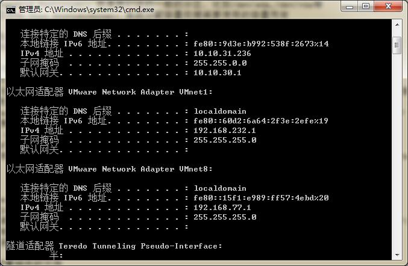

# Linux系统安装  
## 分区方案  
* LVM：一种可以弹性增加/减少档案系统容量的设定  
* 标准分区(Standard Partition)：就是我们说的一般的分区，比如/dev/sda,/dev/vda等  
* LVM紧张供应(LVM Thin Provisioning)：系统分配容量依据需要使用的容量而定  
## 挂载点  
* /：实际挂载点：/，分区类型：LVM分区，文件格式：xfs，大小：10G  
* /home：实际挂载点：/home，分区类型：LVM分区，文件格式：xfs，大小：5G  
* /var  
* swap：实际挂载点：**没有挂载点**，分区类型：LVM分区，文件格式：swap，大小：1G  
* /boot：实际挂载点：/boot，分区类型：标准分区，文件系统格式为：xfs，大小：1G  
* biosboot：创建出来的文档名是/dev/sda1或/dev/vda1,因为是bios使用，所有创建出来的文档实际**没有挂载点**，且其分区类型为**标准分区**，该档案系统是**BIOS Boot**，大小：2M  
## 档案系统类型  
* ext2/ext3/ext4：早期的Linux文档系统类型，ext3/ext4增加了日志记录功能，目前这种文档系统使用较少  
* swap：磁盘模拟成内存，其不使用目录树的挂载，不需要指定挂载点  
* BIOS Boot：GPT分区表可能使用到的项目（若使用MBR分区格式，不需要指定此项）  
* xfs：CentOS预设的文档系统，很适合大容量的磁盘管理  
* vfat：同时被Linux和Windows支持的文档系统类型，如果主机磁盘上同时存在Linux和Windows系统，设置vfat文档系统可进行资料的互换  
***  
## 拓展  
### KVM  
> Kernel-based Virtual Machine,开源的系统虚拟化模块，使用Linux自身的调度器进行管理  
### 手动设置IP  
> ip固定，但是这里还有设置网关和域名解析服务器地址，不然不能上网（还不知道为什么，后面再看看为什么?*没有设置DNS地址，在/etc/resolv.conf就没有nameserver这一项，但这只是不能解析域名呀，我又没有使用域名，和不能上网有什么关系呢？*）  
> 设置网关和域名解析服务器地址依据是虚拟机的ip地址  
> 重启网络服务命令：service network restart  
  
#### 两个IP配置相关的文件  
* /etc/resolv.conf：主要内容：nameserver：DNS服务器的IP地址；domain：本地域名  
* /etc/sysconfig/network-scripts/ifcfg-ens33（ens33是我们自定义的名字）：这里是关于ip相关的主要设置  
#### 问题  
1、必须要设置网关和DNS服务器IP，还必须要设置成一样的，看我的虚拟机上的地址是192.168.77.1：但是我的geteway和dns IP要设置成192.168.77.2，然后才能上网，这是为啥？