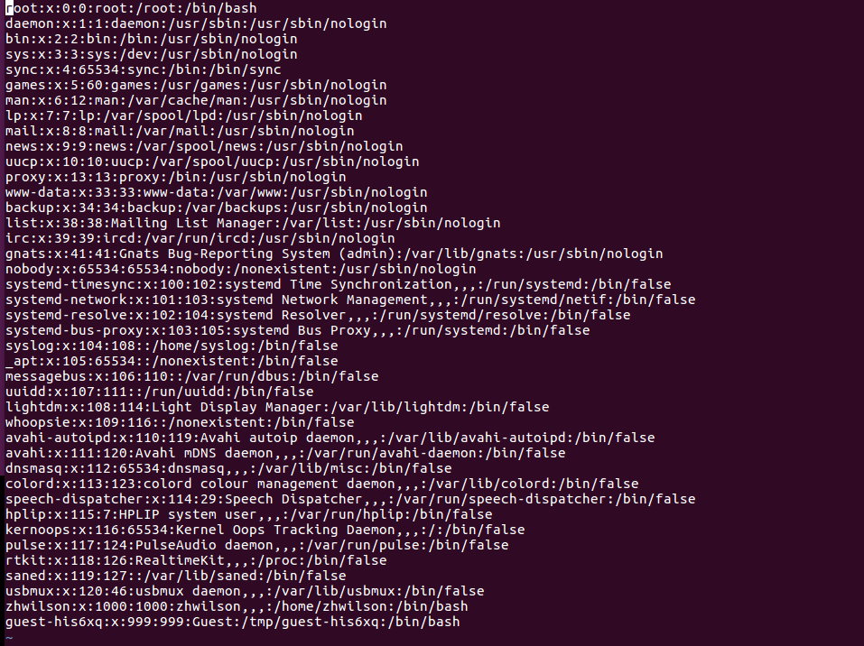
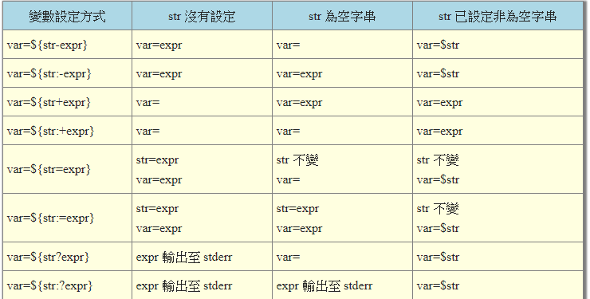

# BASH  
## 知识回顾  
* 操作系统：有效率的控制计算机的硬件资源，提供电脑运作的功能，并向上层提供系统调用  
* 内核(kernel)：真正管理计算机硬件的程序  
## 什么是shell  
> shell：提供使用者使用操作系统界面的软件（命令解析器），类似于DOS下面的cmd.exe,它接收用户命令，执行相应的操作或者调用相应的应用程序  
> 同时shell也是一种程序设计语言，它交互式的解释和执行用户输入的命令或自动的解释和执行预先设定好的一连串的命令  
> 一般使用者只能通过shell来与系统核心沟通，以执行我们想执行的操作  
## shell分类  
* 图形界面shell（Graphical User Interface shell, GUI shell）:包括：Windows Explorer，Linux shell  
* 命令行式shell（Command Line Interface shell， CLI shell）：包括：cmd.exe, Windows PowerShell， bash/sh/ksh/csh  
## 硬件、内核与shell  
电脑执行一个操作需要经过下面的过程：  
1. 电脑具有相关的硬件（比如声卡）  
2. 内核支持（能用）这个硬件（就是需要硬件提供相关的驱动程序）  
3. 使用者发出使用这个硬件的命令  
> 解释：当我们发出命令时，硬件怎么知道我们下达了命令呢，这是通过内核（kernel）来控制的，我们下达的命令必须透过shell与kernel沟通，kernel再通过控制相关的硬件实现相应的操作  
## Linux上使用的shell  
* Bourne SHell(sh)  
* Sun预设的C SHell  
* 商业上常使用的K SHell  
* TCSH  
* Bourne Again SHell(bash)  
**我们可以通过查看/etc/shells文件知道当前Linux使用的shell**  
> Linux上预设的是bash  
> 当前登录的用户可使用的shell可在/etc/passwd中查看，最后一个资料便是其可使用的shell  
  
  
*上图说明，root用户以及zhwilson用户使用的shell是/bin/bash,而一些用户则使用的是/usr/sbin/nologin*  
## Bash shell的功能  
* 命令修复能力(history)：在当前用户家目录的.bash_history中记录使用过的命令，因此我们可以使用上下键找到前/后输入的命令（.bash_history中存储的是上次登入系统执行的命令，当前登录执行的命令存储在内存中，当我们登出系统时，内存才将当前登录执行的命令存储到该文件中）  
* 命令与档案补全功能：就是tab键的功能  
* 命令别名设定功能(alias)：我们可以使用命令：alias ll='ls -li' 来设定ll为ls -li的别名，这样当我们需要使用ls -li命令的时候，直接使用ll就可以了  
* 工作控制、前景背景控制(job control, foreground, background):使用前景、背景控制可以使工作更顺利的进行，使用工作控制，可以将工作放到背景中执行，实现多工的效果  
* 程序化脚本(shell script)：实现类似dos下的批处理工作  
* 万用字符(wildcard):使用*来代替任何字符  
## 相关知识点  
### 通过type来查看命令是不是bash shell的内建命令  
> type命令：type [-tpa] 命令名称，如type -a ls  
#### 指令的分类  
* file：外部指令  
* alias：命令别名设定的名称  
* builtin：bash内建的指令  
### 指令的下达与快速编辑  
* 当命令过长，可使用“\[Enter]”来跳过Enter键的开始执行操作，达到换行的目的，“\”作用的跳过下一个字符  
* 当命令过长，我们想从光标处向前/向后删除指令的快捷键：[Ctrl]+u/[Ctrl]+k
* 让光标移动到命令的最前面/后面：[Ctrl]+a/[Ctrl]+e或者home/end  
### Shell的变数功能  
#### 变数  
> 让一个固定的字符串代表不固定的内容  
##### 变数的相关操作  
* 变数的读取：如：echo $PATH 或 echo ${PATH}  
* 变数的设定：如：ZH=zhwilson  
* 变数的设定规则：  
1. 等号两端不能有空格，如ZH = zhwilson和ZH=zh wilson都是不行的（变数内容中含有空格时，可使用双引号或单引号包起来）  
2. 变数只能含有数字和字母，且不能用数字开头  
3. 变数设定时，设定内容使用双引号“和单引号‘包起来,当内容中有”$变数“时，结果是不一样的，如：ZH="lang is $LANG"，结果可能是：lang is en_US.utf-8;当ZH='lang is $LANG'，结果是：lang is $LANG  
4. 变数内容中可以使用转义符”\“来转义[Enter]、$、\、空白符、'等  
5. 变数内容中可以使用`指令`或$(指令)来使用其他命令提供的信息，如：version=`uname -r` 或version=$(uname -r)  
6. 变数内容可以使用"$已有变数"或${已有变数}在已有变数上增加内容，如：ZH="$ZH"neil 或者 ZH=${ZH}neil  
7. 可使用export将变数设置成环境变数，如：export ZH,将可在如何子程序中使用变数ZH  
8. 一般自定义变数使用小写，系统变速使用大写  
9. 取消变数设定(unset)，如：unset ZH  
10. 变数的设定保存在当前用户家目录的.bashrc文件中  
11. 列出当前用户所有环境变数及其内容的命令；env/export  
12. 列出所有环境变数和自定义变数命令：set  
13. 变数PS1表示的意义：即我们在输入命令前的一大串字符，如：zhwilson@zhwilson-virtual-machine:~$  可通过man bash查看PS1的相关信息  
14. $本身也是一个变数，表示当前shell的PID(Process ID, 程序识别码)，查看当前shell的PID：echo $$  
15. ?也是一个变数，表示上一个指令的返回值，一般的指令执行成功之后的返回值是0，否则，则是一个非0的错误代码，查看上一个指令的返回值：echo $?  
16. 将变量设置为用户从键盘输入的数据(read)：如：read [-pt] zh, -p表示输入提示，-t表示等待输入时间  
17. 声明变量的类型(declare/typeset)：如：declare [-aixr] zh, 默认情况下，变量的类型都是字符串，-a表示设置变量的类型为数组，-i表示设置变量类型为数字(integer)类型（不支持小数），-x表示设置变量成环境变量，-r表示设置的变量只读(readonly),不能修改，也不能unset  
##### 环境变数与自定义变数  
bash执行命令时就是通过指令调用其它的应用程序，也就是一个bash调用另一个bash，这里就有父程序和子程序的关系（不同的程序可通过bash指令进入，exit指令退出，echo $$指令查看当前的PID），在程序调用的过程中，父程序进入睡眠，子程序执行任务，此时，在父程序中设置的自定义变数不会被子程序继承，只有环境变数才能被子程序集成  
* env/export只能查看环境变数  
* set可以查看所有变数  
* export可以将自定义变数设置成环境变数，如：export ZH  
##### 环境变量可以被子程序应用的原因  
> 这和内存的配置管理有关系  
1. 当启动一个shell，操作系统会给这个shell分配一块内存，这块内存中的变量可以让子程序使用  
2. 若父程序使用export命令时，可以将相应的自定义变量存储到上述内存中（这个过程时不可逆的，子程序中使用export设置环境变量，退出子程序，回到父程序，是无法使用子程序设置的环境变量的）  
3. 当载入另一个shell时，子程序可以将父程序的环境变量的内存区块导入到自己的环境变量区块中  
## 文件系统和程序的限制  
**我们需要限制使用者的某些资源，包括文档的打开数量，使用cpu的时间，可使用的内存大小等**  
> 命令：ulimit [-SHacdflcu] [大小]  
## 变数内容的删除、取代与替换  
### 变数内容的删除  
* 这里的删除不是真的把字符串从变量的内容中删除，一般做显示或者赋值时使用，变量的原始内容依然时不变的  
* 从变数内容的开始向右匹配，且删除与要删除字符串匹配的最短的那段内容，如：${variable#要删除的内容}  
* 从变数内容的开始向右匹配，且删除与要删除字符串匹配的最长的那段内容，如：${variable##要删除的内容}  
* 从变数内容的后面向前匹配，且删除与要删除字符串匹配的最短的那段内容，如：${variable%要删除的内容}  
* 从变数内容的后面向前匹配，且删除与要删除字符串匹配的最长的那段内容，如：${variable%%要删除的内容}  
### 变数内容的替换  
* 这里的替换也是不是真正的将变数的内容进行替换，也是一般做显示和赋值的时候使用  
* 从开始向右将第一个出现的与字符串匹配的内容替换成要替换的内容，如：${variable/要替换的内容/替换的内容}  
* 将变数内容中所有与字符串匹配的内容替换成要替换的内容，如：${variable//要替换的内容/替换的内容}  
  
* "-"：只要str已设定，不论是不是空字符串，var最终的值都是${str}，否则其值为expr  
* ":-"：只要str的值为空，就是没设定或是空字符串，var的值都是expr，否则其值为${str}  
* "+"：只要str已设定，不论是不是空字符串，var最终的值都是expr，否则其值为“空字符串”  
* ":+"：只要str的值为空，就是没设定或是空字符串，var的值都是“空字符串”，否则其值为expr  
* "="：只要str已设定，不论是不是空字符串，str的值保持不变，且var最终的值都是${str}，否则str和var的值都会被设定为expr  
* ":="：只要str的值为空，就是没设定或是空字符串，str和var的值都被设定为expr，否则str的值保持不变，var的值为${str}  
* "?"：只要str已设定，不论是不是空字符串，var最终的值都是${str}，否则将expr输出至stderr  
* ":?"：只要str的值为空，就是没设定或是空字符串，都将expr输出至stderr，否则var的值为${str}  
## 命令别名与历史命令  
### 命令别名  
* 别名查看：alias  
* 设置别名(alias)，如：alias ll='ls -li'  
* 取消别名(unalias)，如：alias ll  
### 命令历史  
* 命令历史查看：history  
* 使用!n来执行历史命令总的第n条命令，如：!66  
* 使用!!来执行上一条命令  
* 使用!command来执行以conmand开头的最近的一条指令，如：!ls  
#### 命令历史的读取与记录过程  
1. 当我们以bash登录Linux主机之后，系统会主动从家目录的.bash_history文件中读取以前进行过的指令，.bash_history中能记录操作指令的限制由环境变量HISTSIZE控制  
2. 当我们登出时，系统会将此次我们登录之后所有执行的指令从内存中更新到.bash_history文件中并保存  
## 指令搜索顺序  
1. 以绝对/相对路径执行指令，如 /bin/ls或./ls  
2. 从alias中找到该指令来执行  
3. 从bash的内建(builtin)指令来执行  
4. 从$PATH变量中顺序搜索第一个该指令来执行  
## 进站欢迎信息  
* 存储位置：/etc/issue或/etc/issue.net（远程进站信息）  
## bash环境变量设置文档  
因为系统的一些环境设置档案，当我们登录Linux主机之后，bash就可以直接读取这些设置档案，规划bash的操作环境  
> 我们想要保存我们的系统设定时，需要修改相应的设定文档，否则在我们登出bash之后，这些设定就失效了  
* login shell：需要完整的登录过程才能获取的bash（如我们切换tty之后就需要重新登录）  
* non-login shell：不需要重复登录就能取得bash（如图形界面的terminal和使用bash命令进去子程序）  
### login shell读取的文档  
* /etc/profile:系统的设定文档  
* ~/.bash_profile或~/.bash_login或~/.profile:个人设定档案  
### /etc/profile文档  
* 保存系统的设定
* 使用者登录时一定会将这个文档的内容读入bash，因此所有使用者都能使用这里的设定  
## 特殊字符  
* "*":有0个或多个任意字符  
* "?":一定有一个任意字符  
* "[]":一定有一个括号内的字符  
* "[-]":在编码顺序内的字符，如[0-9]  
* "[^]":字符不是^之后的字符，如[^abc]  

***  
* 查看系统中的快捷键：stty -a  
